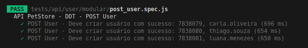
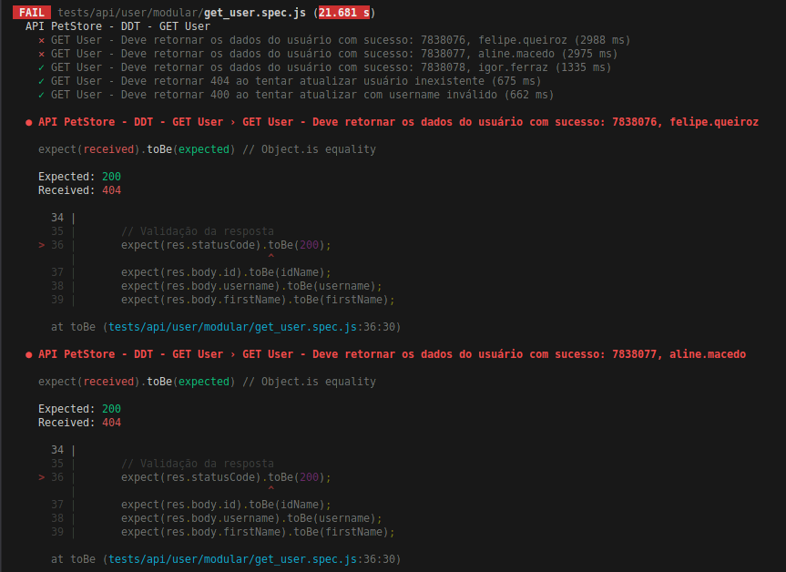
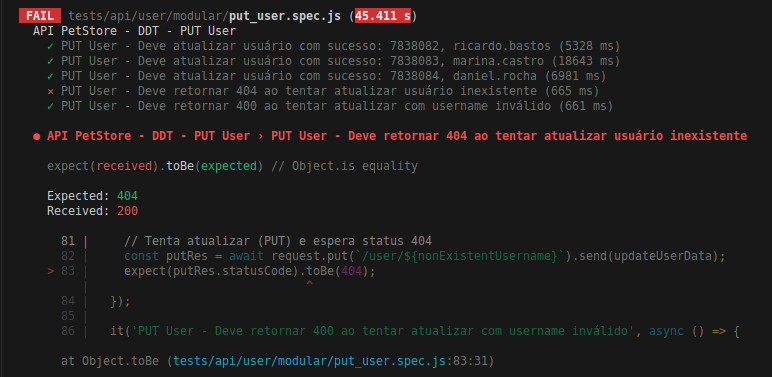
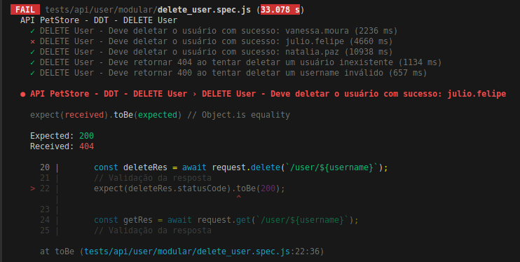
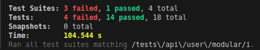

<div  align="center">
	<h1>
		📡 Teste de API com SuperTest
	</h1>
</div>

## 🧐 Descrição

Este repositório contém testes automatizados desenvolvidos durante o curso "Formação em Teste de Software" da [Iterasys](https://iterasys.com.br/pt), ministrado pelo professor José Correia. O
objetivo do projeto é aplicar testes automatizados utilizando **SuperTest** e **Jest** para validar a API de treinamento [PetStore](https://petstore.swagger.io/#/).

## 📚 Aprendizados e Decisões de Implementação

Durante as aulas e a lista de exercício, foram abordados os seguintes tópicos:

- Configuração e uso do **SuperTest** para testes de API.
- Criação de testes para o CRUD da entidade **Pet** e **User**.
- Implementação de testes automatizados utilizando **Jest**.
- Boas práticas de organização de testes.
- Desenvolvimento de **testes em formato data-driven**, utilizando arrays de dados e iteração (com `forEach` ou `it.each`) para cobrir múltiplos cenários. Exemplo estudado: testes CRUD da entidade Pet utilizando arquivos de massa de dados.

Além do conteúdo visto em aula, tomei algumas decisões e adotei práticas por conta própria para tornar o projeto mais escalável:

- **Reutilização de Código:** criação de utilitários como `setupUsers` e `cleanupUsers` para centralizar a lógica de criação e remoção de usuários, evitando repetição e facilitando manutenção.
- **Boas Práticas de Setup e Limpeza:** uso dos hooks `beforeAll` para garantir a criação dos dados necessários antes dos testes, e `afterAll` para remover todos os usuários criados, mantendo o ambiente limpo e previsível para execuções futuras.
- **Data-Driven:** organização dos dados de teste em arquivos externos, facilitando a extensão para novos cenários e a manutenção dos dados.
- **Async/Await:** optei por `async`/`await` ao invés de `then()` para melhorar a legibilidade do código, garantir o fluxo correto das operações assíncronas e evitar problemas com valores indefinidos.
- **Scripts de Teste:** incluí scripts no `package.json` para facilitar a execução dos testes, padronizar comandos e permitir execuções específicas (CRUD, sequencial, verbose, etc).
- **Timeouts Ajustados:** os arquivos de teste usam `jest.setTimeout()` para garantir que operações demoradas não falhem por timeout.
- **Estrutura Modular:** cada método CRUD da entidade User possui seu próprio arquivo de teste.

## 🚀 Funcionalidades Testadas

Os seguintes endpoints da API PetStore foram testados:

### Entidade Pet

- **POST /pet** - Cadastro de novo pet
- **GET /pet/{petId}** - Consulta de pet por ID
- **PUT /pet** - Atualização de pet
- **DELETE /pet/{petId}** - Exclusão de pet

### Entidade User

- **POST /user** - Cadastro de novo usuário
- **GET /user/{username}** - Consulta de usuário por username
- **PUT /user/{username}** - Atualização de usuário
- **DELETE /user/{username}** - Exclusão de usuário

> **Nota:** Os métodos de login e "Create list of users with given input array" não foram implementados conforme orientação do exercício.

> ## ⚠️ Observações sobre Ambiente de Testes
> Os testes deste projeto são executados contra a API pública de treinamento [PetStore](https://petstore.swagger.io/#/), que é compartilhada por muitos usuários. Por isso, podem ocorrer falhas esporádicas devido a:
>
> - Instabilidade ou manutenção do backend da API.
> - Conflitos de dados (outros usuários podem criar, atualizar ou deletar os mesmos usernames/ids).
> - Falta de isolamento de ambiente.

## 📚 Tecnologias Utilizadas

- **IDE:** VS Code
- **Sistema operacional:** Ubuntu Linux
- **Linguagem:** JavaScript (Node.js)
- **Framework de Teste:** Jest
- **Biblioteca para Testes de API:** SuperTest
- **Gerenciador de Pacotes:** npm

## ⚙️ Configuração do Ambiente

### 📋 Pré-requisitos

- Node.js (versão 16+ recomendada).

### 🛠️ Instalação

Siga os passos abaixo para configurar o ambiente e executar os testes do projeto:

### 1. Clonar o repositório

Abra o terminal e execute:

```sh
git clone <URL_DO_REPOSITORIO>
```

### 2. Instalar dependências

Certifique-se de ter o Node.js instalado.
Em seguida, instale as dependências do projeto:

```sh
npm install
```

## 🧪 Execução dos Testes

Para executar os testes automatizados, Uuilize os scripts do `package.json` para rodar os testes:

- Todos os testes (paralelo):

```sh
npm test
```

- Todos os testes (sequencial):

```sh
npm run test:sequential
```

- Testes de User (sequencial e detalhado):

```sh
npm run test:userSequential
```

- Testar apenas um método específico:

```sh
npm run test:post
npm run test:get
npm run test:put
npm run test:delete
```

Certifique-se de que os scripts estão presentes em seu `package.json`.

Exemplo de scripts no `package.json`:

```sh
"scripts": {
"test": "jest",
"test:sequential": "jest --runInBand",
"test:detectOpenHandles": "jest --detectOpenHandles",
"test:user": "jest tests/api/user/modular",
"test:userSequential": "jest --runInBand --verbose tests/api/user/modular",
"test:post": "jest --runInBand tests/api/user/modular/post_user.spec.js",
"test:get": "jest --runInBand tests/api/user/modular/get_user.spec.js",
"test:put": "jest --runInBand tests/api/user/modular/put_user.spec.js",
"test:delete": "jest --runInBand tests/api/user/modular/delete_user.spec.js"
}
```

## 📸 Evidências dos Testes

Abaixo, algumas evidências extraídas das execuções mostrando testes:

### POST /user

<p align="center">
  
  <br>
  <i>POST /user - Criação de usuário</i>
</p>

### GET /user/{username}

<p align="center">
  
  <br>
  <i>GET /user/{username} - Consulta de usuário</i>
</p>

### PUT /user/{username}

<p align="center">
  
  <br>
  <i>PUT /user/{username} - Atualização de usuário</i>
</p>

### DELETE /user/{username}

<p align="center">
  
  <br>
  <i>DELETE /user/{username} - Exclusão de usuário</i>
</p>

#### Resumo da execução dos testes

1. **Com imagem (print do rodapé do Jest):**
<p align="center">
  
  <br>
  <i>Resumo da execução dos testes CRUD (test suites, tests, tempo total)</i>
</p>

2. **Com bloco de código (texto copiado do terminal):**

```sh
Test Suites: 3 failed, 1 passed, 4 total
Tests:       4 failed, 14 passed, 18 total
Snapshots:   0 total
Time:        104.544 s
Ran all test suites matching /tests\/api\/user\/modular/i.
```

## 🦸🏻‍♀️ Autor

<div align="center">
  <a href="https://github.com/janascher">
    
    <br />
    <sub>
      <b>Janaína Scher</b> 👩🏻‍💻
    </sub>
    <br />
    <i>Profissional em Teste de Software e Garantia da Qualidade (QA)</i>
  </a>
</div>
